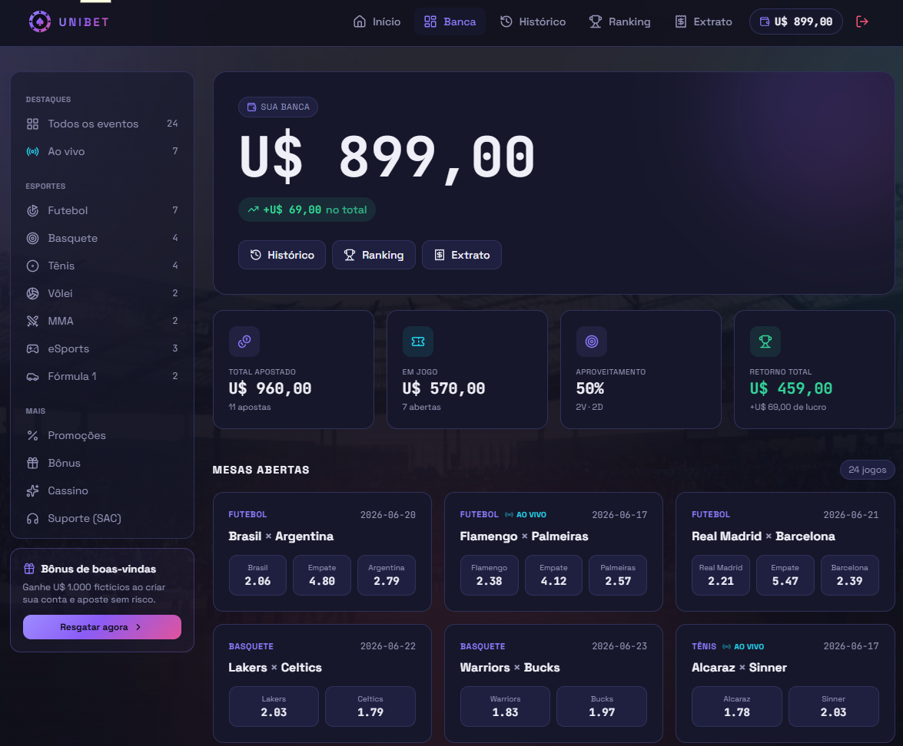

# Uni Bet — Sistema Simulado de Apostas Esportivas

Plataforma web acadêmica que simula uma casa de apostas esportivas fictícia, com perfis de
administrador e jogador, odds dinâmicas no modelo _pari-mutuel_, saldo simulado, histórico,
ranking, bônus diário e extrato de movimentações. Os dados são consumidos de uma API simulada
via JSON Server.

<p align="center">
  
</p>

> **Aviso acadêmico.** Este projeto tem finalidade exclusivamente educacional. Todos os valores,
> saldos, apostas, prêmios, bônus e movimentações são fictícios. Nenhum dinheiro real está
> envolvido.

---

## 1. Identificação

| Campo            | Valor                                    |
| ---------------- | ---------------------------------------- |
| Plataforma       | Uni Bet                                  |
| Disciplina       | Desenvolvimento Web Front End            |
| Professor(a)     | Christien Lana Rachid                    |
| Tipo de trabalho | Desenvolvimento em dupla                 |
| Integrante 1     | Gabriel Azevedo                          |
| Integrante 2     | Paulo Victor                             |
| Repositório      | https://github.com/azevedosvg/unibet.git |

---

## 2. Sumário

1. [Identificação](#1-identificação)
2. [Sumário](#2-sumário)
3. [Descrição geral do sistema](#3-descrição-geral-do-sistema)
4. [Tecnologias utilizadas](#4-tecnologias-utilizadas)
5. [Organização do projeto](#5-organização-do-projeto)
6. [Como executar](#6-como-executar)
7. [Usuários de teste](#7-usuários-de-teste)
8. [Principais rotas do sistema](#8-principais-rotas-do-sistema)
9. [Principais telas](#9-principais-telas)
10. [Regras de negócio](#10-regras-de-negócio)
11. [Funcionalidade extra](#11-funcionalidade-extra)
12. [Checklist de requisitos obrigatórios](#12-checklist-de-requisitos-obrigatórios)
13. [Mapeamento dos critérios de avaliação](#13-mapeamento-dos-critérios-de-avaliação)
14. [Divisão de tarefas entre os integrantes](#14-divisão-de-tarefas-entre-os-integrantes)
15. [Estrutura de dados (db.json)](#15-estrutura-de-dados-dbjson)
16. [Padrão de commits](#16-padrão-de-commits)
17. [Dificuldades encontradas](#17-dificuldades-encontradas)
18. [Melhorias futuras](#18-melhorias-futuras)

---

## 3. Descrição geral do sistema

O Uni Bet simula o funcionamento de uma plataforma de apostas esportivas, permitindo a interação
entre dois perfis:

- **Administrador** — cadastra eventos esportivos, abre e encerra as apostas, informa o resultado
  de cada evento e acompanha a plataforma. Ao informar o vencedor, o sistema liquida automaticamente
  todas as apostas pendentes do evento.
- **Jogador (usuário comum)** — visualiza os eventos disponíveis, realiza apostas fictícias,
  acompanha o saldo simulado, consulta o histórico de apostas, o ranking, e o extrato de
  movimentações.

O grande diferencial do sistema é o cálculo de odds no modelo **pari-mutuel**: as cotações não são
fixas, e sim derivadas do volume apostado em cada lado do evento. Quanto mais gente aposta em um
lado, menor a odd daquele lado; quanto menos gente, maior. A casa retém uma taxa fixa de 5%.

---

## 4. Tecnologias utilizadas

| Categoria               | Tecnologia                                                                         |
| ----------------------- | ---------------------------------------------------------------------------------- |
| Biblioteca de interface | React 19                                                                           |
| Build tool / dev server | Vite 8                                                                             |
| Roteamento              | React Router DOM 7                                                                 |
| Estado global           | Context API                                                                        |
| Hooks                   | React Hooks (`useState`, `useEffect`, `useContext`) e hook customizado (`useOdds`) |
| Consumo de API          | Axios                                                                              |
| API simulada            | JSON Server                                                                        |
| Estilização             | Tailwind CSS 3 (+ PostCSS / Autoprefixer)                                          |
| Animações               | Framer Motion                                                                      |
| Ícones                  | Lucide React                                                                       |
| Qualidade de código     | ESLint                                                                             |
| Versionamento           | Git / GitHub                                                                       |

---

## 5. Organização do projeto

O código é organizado por responsabilidade, separando interface, estado global, regras de negócio,
consumo de API e roteamento.

```
unibet/
├── db.json                  # Base de dados simulada (JSON Server)
├── index.html
├── package.json
├── vite.config.js
├── tailwind.config.js
├── postcss.config.js
├── eslint.config.js
└── src/
    ├── components/          # Componentes reutilizáveis de interface
    │   ├── ui/              # Design system: Button, Input, Card, Badge, Logo, SocialButtons
    │   ├── BetSlip.jsx      # Cupom de apostas
    │   ├── EventCard.jsx    # Card de evento (vitrine)
    │   ├── Header.jsx       # Cabeçalho global + navegação por perfil
    │   ├── Sidebar.jsx      # Filtro de esportes
    │   ├── Footer.jsx
    │   └── oddBadge.jsx
    ├── contexts/            # Context API (estado global)
    │   ├── AuthContext.jsx      # Sessão, login/logout, bônus diário
    │   ├── BetSlipContext.jsx   # Seleções do cupom de apostas
    │   └── ToastContext.jsx     # Notificações na tela
    ├── hooks/
    │   └── useOdds.js       # Cálculo das odds pari-mutuel
    ├── pages/               # Telas (uma por rota)
    │   ├── Login.jsx
    │   ├── Home.jsx
    │   ├── AdminDashboard.jsx
    │   ├── UserDashboard.jsx
    │   ├── BetScreen.jsx
    │   ├── History.jsx
    │   ├── Ranking.jsx
    │   └── Statement.jsx        # Funcionalidade extra (extrato)
    ├── routes/
    │   ├── AppRoutes.jsx        # Mapa de rotas
    │   └── ProtectedRoute.jsx   # Controle de acesso por perfil
    ├── services/           # Camada de acesso à API (nenhum componente chama o Axios direto)
    │   ├── api.js              # Cliente Axios (baseURL)
    │   ├── userService.js
    │   ├── eventService.js
    │   ├── betService.js
    │   ├── bettingService.js
    │   ├── bonusService.js
    │   └── settlementService.js
    ├── utils/
    │   └── format.js       # Formatação de valores monetários
    ├── App.jsx
    ├── index.css           # Tailwind + estilos base
    └── main.jsx            # Ponto de entrada (providers globais)
```

---

## 6. Como executar

### Pré-requisitos

- Node.js 18 ou superior
- npm

### Instalação

```bash
git clone https://github.com/azevedosvg/unibet.git
cd unibet
npm install
```

### Passo 1 — Subir a API simulada (JSON Server)

Em um terminal, execute:

```bash
npm run server
```

A API ficará disponível em **http://localhost:3000**, servindo as coleções `users`, `events`,
`bets` e `transactions` a partir do arquivo `db.json`.

> O cliente Axios (`src/services/api.js`) está configurado com `baseURL: http://localhost:3000`.
> Mantenha o JSON Server nessa porta para a aplicação funcionar.

### Passo 2 — Subir a aplicação React

Em outro terminal (com o JSON Server ainda rodando), execute:

```bash
npm run dev
```

A aplicação ficará disponível em **http://localhost:5173** (porta padrão do Vite).

### Scripts disponíveis

| Script            | Descrição                                           |
| ----------------- | --------------------------------------------------- |
| `npm run dev`     | Inicia a aplicação React em modo de desenvolvimento |
| `npm run server`  | Inicia o JSON Server na porta 3000                  |
| `npm run build`   | Gera o build de produção                            |
| `npm run preview` | Pré-visualiza o build de produção                   |
| `npm run lint`    | Executa o ESLint                                    |

---

## 7. Usuários de teste

Todos os usuários utilizam a senha **`123`**.

| Perfil        | Nome           | E-mail              | Saldo inicial |
| ------------- | -------------- | ------------------- | ------------- |
| Administrador | Administrador  | `admin@unibet.com`  | U$ 0          |
| Jogador       | João Silva     | `joao@unibet.com`   | U$ 699,00     |
| Jogador       | Maria Souza    | `maria@unibet.com`  | U$ 640,00     |
| Jogador       | Pedro Henrique | `pedro@unibet.com`  | U$ 652,20     |
| Jogador       | Ana Clara      | `ana@unibet.com`    | U$ 788,60     |
| Jogador       | Lucas Martins  | `lucas@unibet.com`  | U$ 497,00     |
| Jogador       | Bianca Rocha   | `bianca@unibet.com` | U$ 920,00     |
| Jogador       | Rafael Lima    | `rafael@unibet.com` | U$ 1.526,80   |

> O saldo de cada jogador é exatamente igual à soma das movimentações do seu extrato, garantindo
> consistência entre as telas.

---

## 8. Principais rotas do sistema

O controle de acesso é feito pelo componente `ProtectedRoute`, que verifica se há sessão ativa e se
o perfil do usuário corresponde ao exigido pela rota. Quem não está logado é enviado para `/login`;
quem está logado com o perfil errado é redirecionado para a própria área.

| Rota         | Acesso        | Tela           | Descrição                                                   |
| ------------ | ------------- | -------------- | ----------------------------------------------------------- |
| `/`          | Público       | Home           | Vitrine de eventos disponíveis, aberta a qualquer visitante |
| `/login`     | Público       | Login          | Autenticação simulada por e-mail e senha                    |
| `/admin`     | Administrador | AdminDashboard | Cadastro, gerenciamento e liquidação de eventos             |
| `/dashboard` | Jogador       | UserDashboard  | Resumo do jogador e acesso às mesas de aposta               |
| `/bet/:id`   | Jogador       | BetScreen      | Tela de aposta de um evento específico                      |
| `/history`   | Jogador       | History        | Histórico das apostas do jogador                            |
| `/ranking`   | Jogador       | Ranking        | Ranking de jogadores                                        |
| `/statement` | Jogador       | Statement      | Extrato de movimentações (funcionalidade extra)             |
| `*`          | Público       | —              | Qualquer rota inexistente é redirecionada para `/`          |

---

## 9. Principais telas

- **Login** — formulário de e-mail e senha. Ao autenticar, o sistema verifica o perfil e concede o
  bônus diário (quando aplicável), redirecionando o administrador para `/admin` e o jogador para
  `/dashboard`.
- **Home (vitrine pública)** — lista os eventos disponíveis com suas odds, com filtro de esportes na
  barra lateral. Acessível mesmo sem login.
- **Painel do administrador** — formulário de cadastro de eventos (com validações), listagem de
  todos os eventos e ações por status: encerrar apostas, reabrir, informar o vencedor (liquidar) e
  excluir.
- **Dashboard do jogador** — área de resumo com saldo, atalhos e situação das apostas.
- **Tela de aposta** — seleção do palpite (Time A, Empate quando aplicável, Time B), exibição das
  odds dinâmicas, valor da aposta, prévia do retorno estimado e confirmação.
- **Histórico de apostas** — lista as apostas do jogador com status (pendente, ganha, perdida) e
  retorno.
- **Ranking** — classificação dos jogadores.
- **Extrato** — movimentações financeiras fictícias com saldo corrente acumulado (funcionalidade
  extra).

---

## 10. Regras de negócio

### Autenticação e sessão

- O login é simulado: o `userService` consulta o JSON Server filtrando por e-mail e senha. Um
  resultado válido autentica o usuário.
- A sessão é mantida no `localStorage` (chave `unibet:user`), de modo que ela sobrevive ao recarregar
  a página (F5). O logout limpa o armazenamento.

### Perfis e controle de acesso

- Cada usuário possui um campo `role`: `admin` ou `user`.
- Rotas privadas são protegidas pelo `ProtectedRoute`, que exige sessão ativa e o perfil correto.
  Tentativas de acesso indevido são redirecionadas.

### Bônus diário

- No primeiro login de cada dia, o jogador recebe um bônus fictício de **U$ 200**.
- O controle é feito pelo campo `lastBonus` (data do último bônus). O administrador não recebe bônus.
- Toda concessão de bônus gera uma movimentação no extrato.

### Ciclo de vida de um evento

```
open (aberto) → closed (encerrado) → settled (finalizado)
```

- Todo evento nasce **aberto**, sem resultado e com os _pools_ zerados.
- O administrador pode **encerrar** as apostas (impede novas apostas) e **reabrir**, se necessário.
- Ao informar o vencedor, o evento passa a **finalizado** e as apostas são liquidadas.

### Odds dinâmicas (pari-mutuel)

- As odds são calculadas pelo hook `useOdds` a partir dos _pools_ (volume apostado em cada lado).
- Fórmula: `odd = (pool_total × 0,95) / pool_do_lado`, onde 0,95 representa a taxa da casa de 5%.
- Quando um lado ainda não recebeu apostas, é usada uma odd padrão de **2,0** (evita divisão por zero).

### Apostas e saldo

- Validações na confirmação da aposta: é obrigatório escolher um palpite, o valor deve ser positivo,
  a aposta mínima é **U$ 10** e o valor não pode exceder o saldo do jogador.
- Ao confirmar a aposta, o sistema, de forma encadeada: debita o saldo do jogador, soma o valor ao
  _pool_ do palpite, cria a aposta com status `pending` e registra a movimentação (valor negativo) no
  extrato.

### Liquidação e atualização do status das apostas

- Ao informar o vencedor, o `settlementService` calcula a **odd final** com os _pools_ fechados e
  percorre todas as apostas pendentes do evento.
- Apostas vencedoras passam a `won`, têm o retorno (`amount × odd_final`) creditado no saldo do
  jogador e geram uma movimentação de prêmio no extrato.
- Apostas perdedoras passam a `lost` com retorno zero.
- O evento é marcado como `settled` e o resultado é registrado.

---

## 11. Funcionalidade extra

**Extrato de movimentações fictícias** (rota `/statement`, tela `Statement.jsx`).

- **Tela/componente próprio:** sim — página dedicada acessível pela navegação do jogador.
- **Consome/altera dados no JSON Server:** sim — lê a coleção `transactions` (ordenada por data) e é
  alimentada automaticamente a cada bônus, aposta e prêmio.
- **Relação direta com o sistema:** registra todas as movimentações financeiras fictícias do jogador
  (bônus, apostas e prêmios), apresentando um **saldo corrente acumulado** linha a linha.
- Cada movimentação possui tipo (`bonus`, `bet`, `prize`), valor (positivo para entradas, negativo
  para saídas), descrição e data. O saldo final do extrato coincide com o saldo exibido no
  cabeçalho.

Além da funcionalidade extra principal, o sistema também conta com **ranking de jogadores**,
**bônus diário** e **filtro de eventos por esporte**, reforçando a aderência ao tema.

---

## 12. Checklist de requisitos obrigatórios

| #   | Requisito                                          | Status   | Onde está implementado                                               |
| --- | -------------------------------------------------- | -------- | -------------------------------------------------------------------- |
| 1   | Login simulado                                     | Atendido | `Login.jsx`, `AuthContext.jsx`, `userService.login`                  |
| 2   | Diferenciação entre administrador e usuário        | Atendido | Campo `role` em `users`; navegação por perfil no `Header`            |
| 3   | Controle de acesso conforme o perfil               | Atendido | `ProtectedRoute.jsx`, `AppRoutes.jsx`                                |
| 4   | Cadastro e gerenciamento de eventos pelo admin     | Atendido | `AdminDashboard.jsx`, `eventService` (CRUD)                          |
| 5   | Visualização de eventos pelo usuário               | Atendido | `Home.jsx`, `UserDashboard.jsx`, `EventCard.jsx`                     |
| 6   | Realização de apostas fictícias                    | Atendido | `BetScreen.jsx`, `bettingService.placeBet`                           |
| 7   | Controle de saldo fictício                         | Atendido | Débito/crédito via `userService.updateUser`; estado no `AuthContext` |
| 8   | Encerramento das apostas pelo administrador        | Atendido | `AdminDashboard.handleCloseBets` (status `closed`)                   |
| 9   | Informação do resultado do evento                  | Atendido | `AdminDashboard.handleSettle`, `settlementService`                   |
| 10  | Atualização do status das apostas após o resultado | Atendido | `settlementService.settleEvent` (`won` / `lost`)                     |
| 11  | Histórico de apostas do usuário                    | Atendido | `History.jsx`, `betService.getBetsByUser`                            |
| 12  | Dashboard ou área de resumo                        | Atendido | `UserDashboard.jsx`, `AdminDashboard.jsx`                            |
| 13  | Bônus, ranking ou premiação fictícia               | Atendido | Bônus diário (`bonusService`), `Ranking.jsx`, prêmios na liquidação  |
| 14  | Consumo de dados com JSON Server                   | Atendido | `api.js` (Axios) + `db.json`                                         |
| 15  | Organização em componentes reutilizáveis           | Atendido | `components/`, `components/ui/`                                      |
| 16  | Uso de rotas com React Router DOM                  | Atendido | `AppRoutes.jsx`, `ProtectedRoute.jsx`                                |
| 17  | Uso de React Hooks                                 | Atendido | `useState`, `useEffect`, `useContext` e hook customizado `useOdds`   |
| 18  | Uso de Context API                                 | Atendido | `AuthContext`, `BetSlipContext`, `ToastContext`                      |
| 19  | Interface minimamente responsiva                   | Atendido | Tailwind responsivo; menu lateral em _drawer_ no mobile              |
| 20  | Funcionalidade extra                               | Atendido | Extrato de movimentações (`Statement.jsx`) — ver seção 11            |

---

## 13. Mapeamento dos critérios de avaliação

| Critério (20 pontos)                                                            | Onde é evidenciado                                       |
| ------------------------------------------------------------------------------- | -------------------------------------------------------- |
| Estrutura inicial, organização de pastas e configuração React/JSON Server (2,0) | Seção 5; `vite.config.js`, script `server`, `db.json`    |
| Login simulado e diferenciação de perfil (2,0)                                  | `Login.jsx`, `AuthContext`, campo `role`                 |
| Rotas, navegação e controle de acesso por perfil (2,0)                          | `AppRoutes.jsx`, `ProtectedRoute.jsx`, `Header.jsx`      |
| Gerenciamento de eventos pelo administrador (2,0)                               | `AdminDashboard.jsx`, `eventService`                     |
| Visualização de eventos e realização de apostas (2,0)                           | `Home.jsx`, `BetScreen.jsx`, `useOdds`                   |
| Controle de saldo fictício e validações básicas (2,0)                           | Validações em `BetScreen`; débito/crédito de saldo       |
| Encerramento, registro de resultado e atualização do status (2,0)               | `handleCloseBets`, `handleSettle`, `settlementService`   |
| Histórico, dashboard, bônus, ranking ou premiação (2,0)                         | `History.jsx`, dashboards, `bonusService`, `Ranking.jsx` |
| Funcionalidade extra integrada ao JSON Server (2,0)                             | `Statement.jsx` + coleção `transactions`                 |
| README, commits individuais, organização e domínio técnico (2,0)                | Este documento; histórico de commits da dupla            |

---

## 14. Divisão de tarefas entre os integrantes

A divisão reflete o histórico real de commits do repositório.

### Gabriel Azevedo

- Configuração inicial do projeto (Vite, React Router, Axios) e do JSON Server.
- Modelagem e construção da base de dados simulada (`db.json`).
- Camada de serviços de usuário e cliente Axios (`api.js`, `userService.js`).
- Autenticação e sessão (`AuthContext`) e rotas protegidas por perfil (`ProtectedRoute`).
- Painel do administrador: cadastro, listagem, validações, encerrar/reabrir/excluir eventos
  (`AdminDashboard`, `eventService`).
- Serviço de liquidação e pagamento de apostas vencedoras (`settlementService`).
- Dashboard do jogador, histórico, ranking e bônus diário.
- Funcionalidade extra: extrato com saldo corrente (`Statement`).
- Estilização geral e ajustes de interface.

### Paulo Victor

- Hook customizado de odds dinâmicas no modelo pari-mutuel (`useOdds`).
- Tela de aposta com odds ao vivo, validações de saldo e registro da movimentação (`BetScreen`).

---

## 15. Estrutura de dados (db.json)

A base simulada possui quatro coleções:

- **users** — `id`, `name`, `email`, `password`, `role` (`admin` | `user`), `balance`, `lastBonus`.
- **events** — `id`, `teamA`, `teamB`, `sport`, `date`, `status` (`open` | `closed` | `settled`),
  `result` (`""` | `A` | `B` | `Draw`), `hasDraw`, `live`, `poolA`, `poolB`, `poolDraw`.
- **bets** — `id`, `userId`, `eventId`, `pick` (`A` | `B` | `Draw`), `amount`, `oddAtBet`,
  `status` (`pending` | `won` | `lost`), `payout`.
- **transactions** — `id`, `userId`, `type` (`bonus` | `bet` | `prize`), `value`, `description`,
  `date`.

A base já vem populada com 8 usuários, 31 eventos (abertos, ao vivo e finalizados, em diversos
esportes), 38 apostas (pendentes, ganhas e perdidas) e 52 movimentações, todas internamente
consistentes (odds derivadas dos _pools_, retornos compatíveis com `valor × odd` e saldo igual à
soma do extrato de cada jogador).

---

## 16. Padrão de commits

O histórico segue mensagens claras e descritivas, no padrão _Conventional Commits_. Exemplos reais
do repositório:

- `feat: add role-based protected routes`
- `feat: add event registration and listing to admin panel`
- `feat: add useOdds hook for dynamic pari-mutuel odds`
- `feat: add bet screen with live odds and balance transaction`
- `feat: add settlement service to pay out winning bets`
- `feat: add transactions statement with running balance (extra feature)`

---

## 17. Dificuldades encontradas

- **Odds dinâmicas (pari-mutuel).** Modelar odds que reagem ao volume apostado, em vez de cotações
  fixas, exigiu centralizar a regra em um hook (`useOdds`) e garantir que a odd vista na tela fosse
  coerente com a odd final aplicada na liquidação (mesma taxa de casa).
- **Consistência entre saldo, apostas e extrato.** Manter o saldo do jogador alinhado às apostas
  pendentes e ao extrato exigiu disciplina nas operações encadeadas (débito de saldo, soma ao
  _pool_, criação da aposta e registro da movimentação).
- **Controle de acesso por perfil.** Garantir que cada rota só fosse acessível ao perfil correto, com
  redirecionamentos adequados, foi resolvido com um componente de rota protegida reutilizável.
- **Persistência de sessão.** Evitar que o usuário fosse deslogado ao recarregar a página foi
  resolvido espelhando a sessão no `localStorage`.

---

## 18. Melhorias futuras

- Hash de senhas e autenticação com token (atualmente o login é simulado para fins acadêmicos).
- Backend real, substituindo o JSON Server por uma API com banco de dados persistente.
- Bloqueio automático de apostas quando o evento atinge a data/horário de início.
- Paginação e busca no histórico e no painel administrativo.
- Testes automatizados (unitários e de integração) para regras de negócio críticas.
- Painel estatístico do administrador com indicadores de volume e resultado por evento.
